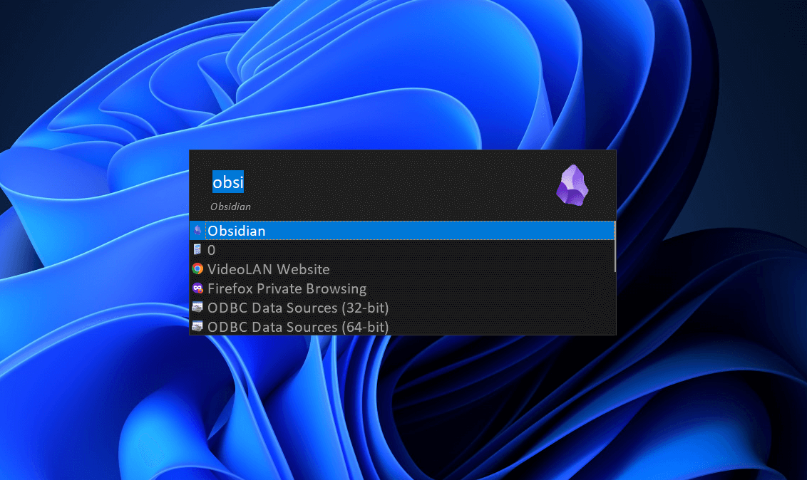

# Dark Flat Skin for Launchy

A simple dark and flat skin for [Launchy](http://www.launchy.net/). 

## What is launchy
> Launchy is a free cross-platform utility designed to help you forget about your start menu, the icons on your desktop, and even your file manager.  
> Launchy indexes the programs in your start menu and can launch your documents, project files, folders, and bookmarks with just a few keystrokes!  
> *Taken from: [launchy.net](http://www.launchy.net/)*

## Requirements
- Launchy

## Setup
1. Go to [releases](https://github.com/kleber-swf/dark-flat-launchy-skin/releases) page and download the latest version.
2. Extract/move the skin files to the `\skins` directory inside Launchy preferences folder (`%LocalAppData%\Launchy\skins`) or installation folder (`C:\Program Files (x86)\Launchy\skins`).
3. In Launchy, go to Settings > Skins and select the skin.

